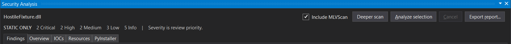
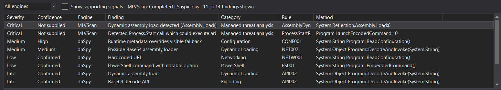

# MLVScan integration

Enable **Include MLVScan**, then choose **Analyze selection**. The selected member's saved assembly is scanned locally with MLVScan.Core 1.9.0. Nothing is uploaded. **Deeper scan** reruns analysis with Core's larger, finite budgets; it can still report incomplete analysis.

The Findings tab combines engine-labelled rows. Use the engine filter to inspect one source, or enable **Show supporting signals** to see Core findings that did not drive its disposition. Core's Critical severity is preserved. Generic Core findings have no supplied confidence; the panel does not infer one from severity.

Overview shows Core's disposition, explanation, version, input hash, completeness, and matched families. A `Clean` disposition describes Core's retained signals, not a guarantee of safety. Built-in findings remain independent. `BlockingRecommended` is retained in the report but never blocks, deletes, or quarantines files.





## Input and evidence

The initial integration supports saved, unmodified, single-module managed assemblies up to 64 MiB in standard mode or 128 MiB with **Deeper scan**. Modified documents must be saved and reopened. Native files, in-memory modules, and standalone netmodules are skipped with a reason. Core recursive resource scanning is disabled because its current locations cannot reliably identify embedded modules; dnSpy's existing resource inspection remains available.

Core scans an immutable byte snapshot. The same bytes supply result hashing and classification. The adapter compares the snapshot with the loaded PE image and built-in hash, checks the backing file again after scanning, and checks it before report export or code navigation. Core requests bypass the built-in result cache. Document edits/removal and option changes clear results and cancel current work.

Call/data-flow chains appear as ordered evidence rows. An exact full signature or unambiguous qualified method name in the scanned module enables navigation. IL offsets must exist in that method. Unresolved locations and ambiguous overloads remain readable without a navigation action.

Markdown, text, and JSON exports include the Core assessment and full engine result, including schema version and relationship IDs. The JSON report adds a `mlvscan` section; existing fields remain. Imported strings are redacted before display or serialization, including snippets, chains, family evidence, and developer guidance. The existing IOC extractor remains the source of the IOC tab.

## Worker boundary

The WPF extension references no Core or Cecil types. A .NET 10 worker pins the Core package and uses `RuleFactory`, `AssemblyScanner`, and `ScanResultMapper.ToDto`. It runs with both the .NET Framework 4.8 and .NET 10 hosts.

One worker handles one request over redirected stdin/stdout. The request contains protocol version, deep-mode flag, input length, and bytes. The response contains protocol version and the Core result. Target data never controls an executable path or shell command. Assembly resolution reads exact-identity metadata only from the worker's bundled directory; unavailable references generate an incomplete-analysis signal. Samples are never loaded into the CLR.

A Windows Job Object terminates the worker when the host exits or the job closes. Cancellation and a separate 180-second Core deadline terminate and reap the process. The memory limit is 1 GiB on a 64-bit OS and 512 MiB on a 32-bit OS. Input is capped at 64 MiB in standard mode or 128 MiB in deep mode; output remains capped at 32 MiB. Larger inputs can still hit the existing worker memory or time limit, which reports failure rather than a clean result. Protocol version 2 enforces the selected limit in both host and worker; rebuild and bundle them together. Display is limited to 20,000 Core findings and 20,000 chain rows (at most 1,000 per chain); truncation is reported, while the complete returned Core payload remains in exports. Output overflow or process failure cannot produce a successful clean assessment.

The worker is a process boundary, not an OS security sandbox. Built-in parsing still runs in dnSpy. No parser is guaranteed safe against arbitrary malformed input.

## Build and validation

`build.ps1` bundles self-contained workers under `bin/mlvscan/win-x86` and `bin/mlvscan/win-x64`. Architecture-specific packages include their matching worker. Worker selection follows host process architecture. The Framework package therefore does not require a separately installed .NET 10 runtime for scanning, but worker execution has .NET 10's Windows OS requirements.

For a development build:

```powershell
dotnet build dnSpy.sln -c Release
./Build/Publish-MlvScanWorker.ps1 -Destination dnSpy/dnSpy/bin/Release/net10.0-windows
dotnet run --project Extensions/dnSpy.SecurityAnalysis.Tests/dnSpy.SecurityAnalysis.Tests.csproj -c Release -- dnSpy/dnSpy/bin/Release/net10.0-windows/mlvscan/win-x64/dnSpy.MlvScanWorker.exe dnSpy/dnSpy/bin/Release/net10.0-windows/mlvscan/win-x86/dnSpy.MlvScanWorker.exe
```

Without worker paths, the fixture runner runs the built-in, mapper, eligibility, and worker-lifecycle tests. Supplying worker paths also runs real Core scans for each executable. The fixture's initializers and entry point throw if invoked; tests inspect its IL without executing it.

The suite covers Critical severity, absent confidence, redaction, hash-only dispositions, incomplete results, schema/hash rejection, modified-input eligibility, repeated semantic output, deep mode, malformed assemblies, cancellation, output overflow, process cleanup, and preservation of built-in findings on Core timeout, host and worker input boundaries, and real x86/x64 deep scans of inputs above 64 MiB. Per-run timestamps and payload-local finding IDs are normalized for repeatability checks.

Core 1.9.0 emits schema 1.4.0. The adapter rejects unknown schema versions; upgrading Core requires reviewing its contract and rerunning these tests. Core's rules are maintained upstream, not copied into dnSpySec.

