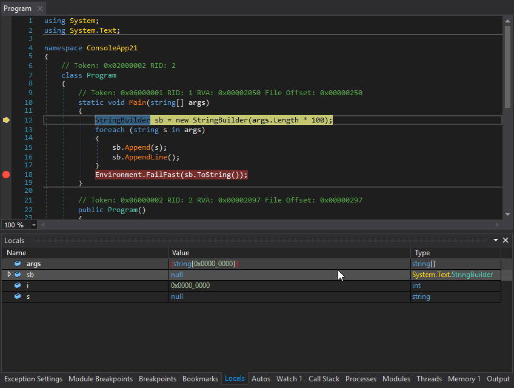
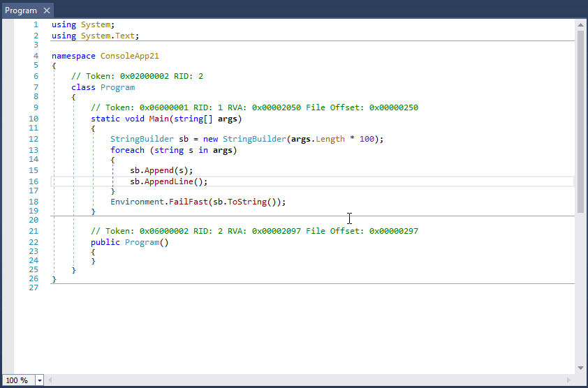

# dnSpySec

dnSpySec is a defensive reverse-engineering fork of [dnSpyEx](https://github.com/dnSpyEx/dnSpy), the unofficial continuation of [dnSpy](https://github.com/dnSpy/dnSpy). It adds static Security Analysis for inspecting suspicious .NET DLLs, executables, game mods, and plugins, alongside dnSpy's existing decompiler, debugger, and assembly editor.

- Debug .NET and Unity assemblies
- Edit .NET and Unity assemblies
- Light and dark themes
- Static Security Analysis with findings, linked evidence, IOC extraction, and report export

See below for more features





## Binaries

Download dnSpySec from this repository's **Releases** page. The current English-only release package excludes language folders and `.pdb` debug symbol files. Extract the whole package and keep the `bin` folder beside `dnSpy.exe`; it contains required assemblies and runtime files.

Upstream dnSpyEx binaries are available from [dnSpyEx releases](https://github.com/dnSpyEx/dnSpy/releases). They do not include this fork's Security Analysis extension.

## Security Analysis

Open a file as a document, select its module or a member in the document tree, then choose **Edit → Security Analysis**. The dockable panel analyzes the selection in the background.

### Analysis features

- File information and MD5, SHA-1, and SHA-256 hashes.
- PE sections, permissions, entropy, overlay information, and certificate-table presence.
- Managed IL calls and P/Invoke declarations grouped by capability.
- Suspicious strings and IOCs, including URLs, URL-derived domains, IPv4 addresses, registry and filesystem paths, scheduled-task references, and selected mutex indicators.
- Recognized Discord, Slack, and Telegram secrets redacted in generated findings and IOCs.
- Embedded-resource format identification, SHA-256, entropy, and PE-header detection.
- Assembly metadata inspection and certain configuration fallback/override patterns.
- Behavioral correlations for download/write/launch patterns, persistence, browser and Discord storage access, security product tampering, process activity, and collection/upload indicators.
- Bounded PyInstaller CArchive/PYZ table inspection and decompression of selected entries.
- Markdown, JSON, and plain-text report and IOC export.

### Analyst workflow

- Findings open first, with text search, severity/category filters, and sortable table columns.
- Resizable detail and evidence panes show explanations, confidence, rule IDs, methods, metadata tokens, RVAs, and IL offsets when available.
- Double-click a finding or evidence row, press Enter on a finding, or use **Go to code** to navigate to the relevant code. IOC double-clicks navigate to referring code; they do not open URLs.
- Hash-copy buttons sit beside hashes in **Overview**. IOC copy/export and resource-save actions are in their own tabs.
- Progress, cancellation, a timeout, result caching, and isolated analyzer errors help keep analysis responsive.
- Results are cleared when the analyzed document changes or is removed, preventing export of outdated results as current.
- The panel follows dnSpy's existing themes.

### Static-only behavior and safety boundaries

> Static analysis only. The sample was not executed and no discovered network endpoint was contacted. Static analysis establishes code and indicators present in the file, but cannot prove that every runtime capability successfully executes on a particular system.

Security Analysis treats target files as data. It does not load them into the CLR, invoke their methods, trigger their initializers, execute embedded payloads or scripts, or make requests to discovered endpoints. Resource extraction writes bytes to a user-selected file and never opens or runs the saved file automatically.

The existing debugger and C# Interactive features can execute code when used; they are separate features with different behavior. The host also loads installed `*.x.dll` plugins at startup. Keep suspicious samples outside dnSpy's application and extension directories and open them as documents.

Parsing hostile files still carries a risk of parser vulnerabilities. Static-only operation is not a guarantee that arbitrary files are safe to inspect.

### Interpreting findings

Severity is a review priority, not a malware verdict. Confirmed confidence refers to visible bytes, metadata, strings, or IL references, not successful runtime behavior. Behavioral rules currently use same-method or same-type co-occurrence; they do not prove data flow or execution order. An empty findings list does not establish that a file is safe, especially when analysis reports errors or coverage limits.

Python bytecode disassembly, detailed native import-table inspection, certificate subject/issuer and chain validation, full call-chain graphs, rule configuration, and deeper obfuscation analysis are not implemented yet.

See the [extension README](Extensions/dnSpy.SecurityAnalysis/README.md), [rule documentation](Extensions/dnSpy.SecurityAnalysis/RULES.md), and [static-analysis security review](Extensions/dnSpy.SecurityAnalysis/SECURITY_REVIEW.md) for implementation details and limits.

## Building

Clone this fork with its submodules, then run from the repository root. The projects target `.NET Framework 4.8` and `.NET 10` for Windows. Use the .NET 10 SDK for the following .NET build:

```PS
git submodule update --init --recursive
dotnet build dnSpy.sln -c Release -f net10.0-windows
```

For packaging from a clean build output, use `./build.ps1 -buildtfm net -NoMsbuild`. Standard builds may produce localized resources and debug symbols; the English-only release package omits them.

Run the harmless static-analysis fixtures with:

```PS
dotnet run --project Extensions/dnSpy.SecurityAnalysis.Tests/dnSpy.SecurityAnalysis.Tests.csproj -c Release
```

The fixtures include a DLL with throwing module/static initializers and an entry point, plus script and PE resource bytes. They are inspected as data without invoking their code.

To debug Unity games, you need this repo too: https://github.com/dnSpyEx/dnSpy-Unity-mono

# Debugger

- Debug .NET Framework, .NET and Unity game assemblies, no source code required
- Set breakpoints and step into any assembly
- Locals, watch, autos windows
- Variables windows support saving variables (eg. decrypted byte arrays) to disk or view them in the hex editor (memory window)
- Object IDs
- Multiple processes can be debugged at the same time
- Break on module load
- Tracepoints and conditional breakpoints
- Export/import breakpoints and tracepoints
- Optional Just My Code (JMC) stepping filters for system libraries
- Call stack, threads, modules, processes windows
- Break on thrown exceptions (1st chance)
- Variables windows support evaluating C# / Visual Basic expressions
- Dynamic modules can be debugged (but not dynamic methods due to CLR limitations)
- Output window logs various debugging events, and it shows timestamps by default :)
- Assemblies that decrypt themselves at runtime can be debugged, dnSpy will use the in-memory image. You can also force dnSpy to always use in-memory images instead of disk files.
- Bypasses for common debugger detection techniques
- Public API, you can write an extension or use the C# Interactive window to control the debugger

# Assembly Editor

- All metadata can be edited
- Edit methods and classes in C# or Visual Basic with IntelliSense, no source code required
- Add new methods, classes or members in C# or Visual Basic
- IL editor for low-level IL method body editing
- Low-level metadata tables can be edited. This uses the hex editor internally.

# Hex Editor

- Click on an address in the decompiled code to go to its IL code in the hex editor
- The reverse of the above, press F12 in an IL body in the hex editor to go to the decompiled code or other high-level representation of the bits. It's great to find out which statement a patch modified.
- Highlights .NET metadata structures and PE structures
- Tooltips show more info about the selected .NET metadata / PE field
- Go to position, file, RVA
- Go to .NET metadata token, method body, #Blob / #Strings / #US heap offset or #GUID heap index
- Follow references (Ctrl+F12)

# Other

- BAML decompiler and disassembler
- Blue, light and dark themes (and a dark high contrast theme)
- Bookmarks
- C# Interactive window can be used to script dnSpy
- Search assemblies for classes, methods, strings, etc
- Analyze class and method usage, find callers, etc
- Multiple tabs and tab groups
- References are highlighted, use Tab / Shift+Tab to move to the next reference
- Go to the entry point and module initializer commands
- Go to metadata token or metadata row commands
- Code tooltips (C# and Visual Basic)
- Export to project

# List of other open source libraries used by dnSpy

- [ILSpy decompiler engine](https://github.com/icsharpcode/ILSpy) (C# and Visual Basic decompilers)
- [Roslyn](https://github.com/dotnet/roslyn) (C# and Visual Basic compilers)
- [dnlib](https://github.com/0xd4d/dnlib) (.NET metadata reader/writer which can also read obfuscated assemblies)
- [VS MEF](https://github.com/microsoft/vs-mef) (Faster MEF equals faster startup)
- [ClrMD](https://github.com/microsoft/clrmd) (Access to lower level debugging info not provided by the CorDebug API)
- [Iced](https://github.com/icedland/iced) (x86/x64 disassembler)
- [Newtonsoft.Json](https://github.com/JamesNK/Newtonsoft.Json) (JSON serializer & deserializer)
- [NuGet.Configuration](https://github.com/NuGet/NuGet.Client) (NuGet configuration file reader)

# Translating dnSpy

[Click here](https://crowdin.com/project/dnspy) if you want to help with translating dnSpy to your native language.

# Wiki

See the [Wiki](https://github.com/dnSpyEx/dnSpy/wiki) for build instructions and other documentation.

# License

dnSpy is licensed under [GPLv3](dnSpy/dnSpy/LicenseInfo/GPLv3.txt).

# [Credits](dnSpy/dnSpy/LicenseInfo/CREDITS.txt)
